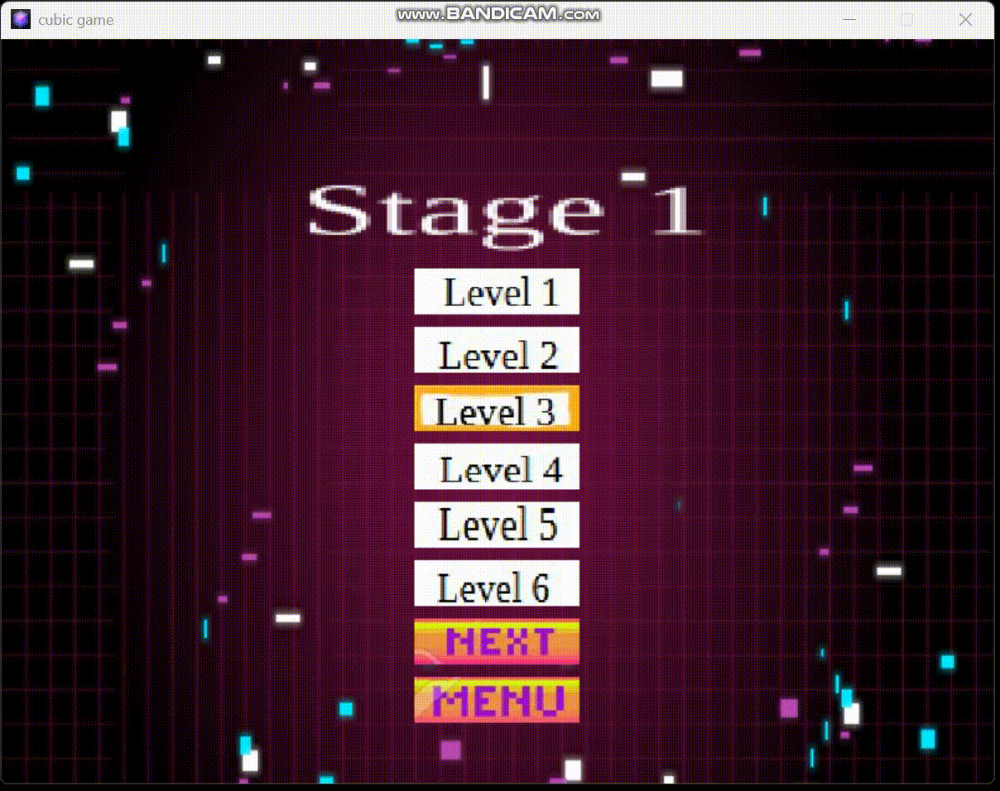
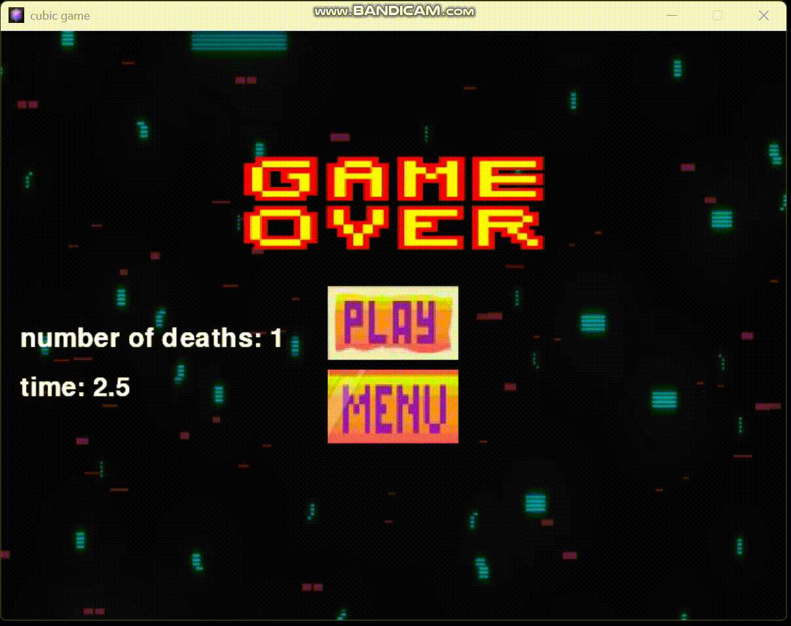
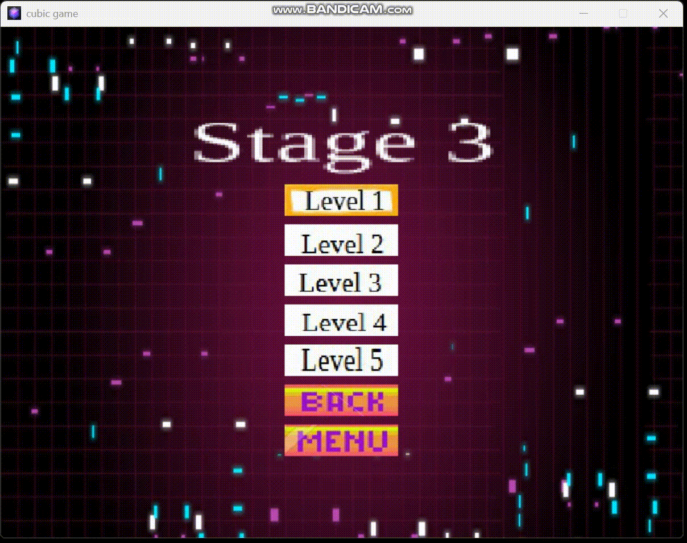

# cubic_game

Un mini-jeu 2D développé avec **Pygame** en **programmation orientée objet**, où vous contrôlez un cube dans un environnement interactif avec des ennemis et des pièces à récupérer.  
Projet personnel visant à expérimenter les bases du développement de jeu avec Python.

## Démo







## Technologies utilisées

- Python 3
- [Pygame](https://www.pygame.org/)

---

## Installation & Lancement

1. **Cloner le projet**
```bash
git clone https://github.com/Tom-Taffin/cubic_game.git
cd cubic_game
```

2. **lancer le jeu**
```bash
python game.py
```

## Fonctionnalités

- Contrôle du cube via les touches directionnelles.
- Création de plusieurs types d’ennemis avec des comportements variés, dont des boss en forme de serpent qui poursuivent le joueur.
- Détection et gestion des collisions.
- Système de scènes avec navigation entre écrans (menu, jeu, défaite…).
- Création de boutons sélectionnables au clic ou au clavier.
- Création et gestion de niveaux progressifs.
- Sauvegarde des scores.
- Animation via enchaînement d’images.
- Gestion de la musique et des effets sonores.
- Timer intégré et parfois affiché sous forme de bar pour gérer le temps de jeu.

## Améliorations futures / en cours de développement

- Développement d'une **IA jouant au jeu via du Deep Q-Learning** pour expérimenter l’apprentissage par renforcement.
- Implémentation d’un **éditeur de niveaux** accessible depuis le menu du jeu.
- Ajout d’un algorithme **A\* (A-star)** permettant à certains ennemis de naviguer dans un labyrinthe de manière stratégique.
